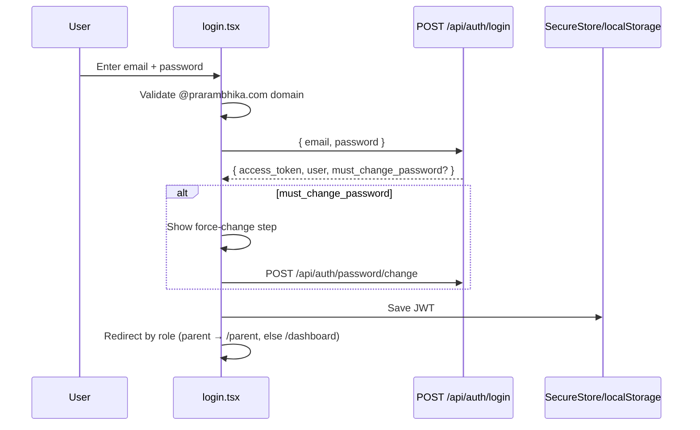
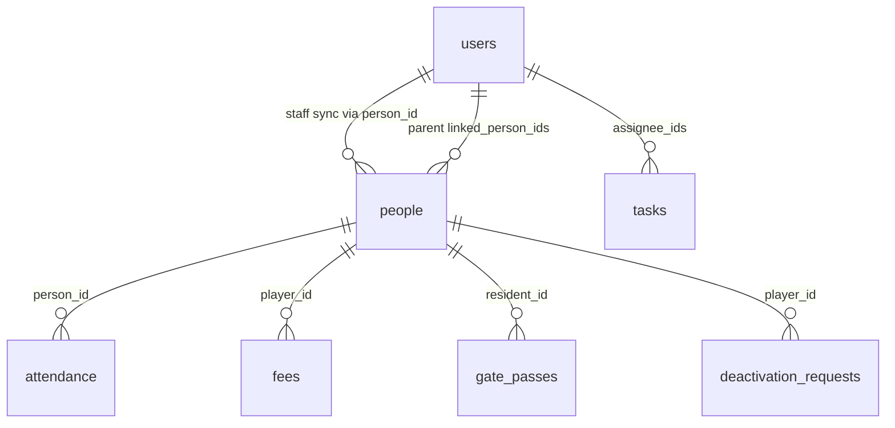

# PWS & ALPHA Tracker — Product Development Guide

**Version:** 1.0 (July 2026)  
**Audience:** Software developers building, extending, or maintaining this product  
**Repositories:**
- Frontend: `client-app/frontend` (Expo / React Native / TypeScript)
- Backend: `client-app-backend` (FastAPI / MongoDB)

**Companion docs:** `memory/PRD.md` (feature changelog), `memory/test_credentials.md` (demo accounts)

---

## Table of Contents

1. [Product Overview](#1-product-overview)
2. [Architecture](#2-architecture)
3. [Repository Map](#3-repository-map)
4. [Roles, Permissions & Navigation](#4-roles-permissions--navigation)
5. [Authentication & Session](#5-authentication--session)
6. [End-to-End Workflows](#6-end-to-end-workflows)
7. [Data Model Reference](#7-data-model-reference)
8. [API Reference](#8-api-reference)
9. [Frontend Routing & UI Shell](#9-frontend-routing--ui-shell)
10. [Business Rules](#10-business-rules)
11. [Local Development & Deployment](#11-local-development--deployment)
12. [Testing Strategy](#12-testing-strategy)
13. [Extension Guidelines](#13-extension-guidelines)

---

## 1. Product Overview

### 1.1 What this app is

**PWS & ALPHA Tracker** is a unified operations portal for two institutions in Patna, Bihar:

| Institution | Code | Scope |
|-------------|------|-------|
| **Prarambhika World School (PWS)** | `PWS` | School: students, teachers, PWS staff, principal/VP |
| **ALPHA Sports Academy** | `ALPHA` | Sports: players, coaches, ALPHA staff, fees, centres |
| **Cross-org** | `BOTH` | Super Admin, warden, some parents |

### 1.2 Problems it solves

- Replace paper attendance registers with fast mobile/web marking
- Centralize rosters (students, players, staff, coaches)
- Collect and track ALPHA sports fees (multi-month, advance, receipts)
- Coordinate tasks across departments
- Manage hostel gate passes and roll call
- Give parents read-only visibility into wards
- Enforce role-based access with a Super Admin permission panel

### 1.3 Core modules

| Module | Primary users |
|--------|---------------|
| Dashboard & Command Center | Admin, Sports Admin, coaches |
| Attendance (student / player / staff / coach) | Teachers, coaches, principal, admin |
| People & roster management | Admin, principal, coaches |
| Fees & financial reports | Sports Admin, Super Admin |
| Tasks | All staff roles |
| Hostel | Warden, Super Admin |
| Parent portal | Parents |
| Permissions & approvals | Super Admin |

---

## 2. Architecture

```
┌─────────────────────────────────────────────────────────────────┐
│                     Client (Expo / Web)                         │
│  expo-router screens  │  AuthContext  │  Axios (/api)           │
│  Sidebar (desktop)    │  SecureStore  │  Role-based components  │
└───────────────────────────────┬─────────────────────────────────┘
                                │ HTTPS  Bearer JWT
┌───────────────────────────────▼─────────────────────────────────┐
│                   FastAPI (server.py)                           │
│  Routers: auth, users, people, attendance, fees, tasks, ...     │
│  core.py: JWT, permissions, Pydantic models, DB client          │
└───────────────────────────────┬─────────────────────────────────┘
                                │ Motor (async)
┌───────────────────────────────▼─────────────────────────────────┐
│                        MongoDB                                  │
│  users, people, attendance, fees, tasks, gate_passes, ...       │
└─────────────────────────────────────────────────────────────────┘
```

### 2.1 Tech stack

| Layer | Technology |
|-------|------------|
| Frontend | Expo SDK 54, React Native 0.81, React 19, TypeScript, expo-router |
| HTTP | Axios — base URL `${EXPO_PUBLIC_BACKEND_URL}/api` (`frontend/src/auth.tsx`) |
| Token storage | `expo-secure-store` (native), `localStorage` (web), key `pws_alpha_token` |
| Backend | FastAPI 0.110, Uvicorn |
| Database | MongoDB via Motor |
| Auth | JWT HS256 (2h expiry), bcrypt passwords |
| Documents | ReportLab (PDF receipts), openpyxl (Excel reports / bulk upload) |
| Deploy | Railway (backend), Expo web export (frontend) |

### 2.2 Environment variables

| Variable | Where | Purpose |
|----------|-------|---------|
| `MONGO_URL` | Backend | MongoDB connection string |
| `DB_NAME` | Backend | Database name |
| `JWT_SECRET` | Backend | Token signing secret |
| `EXPO_PUBLIC_BACKEND_URL` | Frontend | API host (no trailing `/api`) |

### 2.3 Startup behavior

On backend startup (`server.py` → `seed_data()`), the app idempotently seeds demo users, sample rosters, tasks, and backfills missing fields (permissions, staff user sync, email domain migration).

---

## 3. Repository Map

### 3.1 Backend (`client-app-backend/`)

```
server.py           # FastAPI app, CORS, router mount, seed on startup
core.py             # DB, auth, roles, permissions, Pydantic models
seed.py             # Demo data + migrations
routers/
  auth.py           # Login, me, password change
  users.py          # User CRUD, directory, activate/deactivate
  people.py         # Roster CRUD (student, player, staff)
  permissions.py    # Templates, audit, PATCH permissions
  attendance.py     # Batch + staff/coach attendance
  coach.py          # Coach dashboard, player list, coach attendance
  dashboard.py      # Generic dashboard stats
  alpha_dashboard.py# ALPHA ERP consolidated metrics
  command.py        # Command center + department drill-downs
  fees.py           # Fee lifecycle, collection, receipts
  reports.py        # Financial reports + Excel export
  tasks.py          # Task CRUD + comments
  hostel.py         # Gate passes, roll call
  parents.py        # Parent portal APIs
  uploads.py        # Bulk player upload
  deactivation.py   # Player deactivation approval workflow
  notifications.py  # In-app notifications
tests/              # Integration tests (pytest + requests)
```

### 3.2 Frontend (`client-app/frontend/`)

```
app/
  _layout.tsx           # AuthProvider, desktop Sidebar shell
  index.tsx             # Auth redirect
  login.tsx             # Email/password sign-in
  (tabs)/               # Mobile bottom tabs (dashboard, attendance, tasks, profile)
  manage/               # Roster CRUD hub and detail screens
  fees/                 # Fees overview + collection
  admin/                # Permissions, bulk upload, approvals
  parent/               # Parent portal (no sidebar)
  task/                 # Task create/detail
  reports.tsx           # Financial reports
  staff-attendance.tsx  # Staff default-present flow
  coach-attendance.tsx  # Coach default-present flow
src/
  auth.tsx              # AuthContext, api client, role colors
  Sidebar.tsx           # Desktop nav + role gates
  GenericDashboard.tsx  # Default dashboard
  AlphaERPDashboard.tsx # Admin desktop ERP dashboard
  CommandCenter.tsx     # Admin mobile command center
  CoachHome.tsx         # Coach dashboard
  GenericAttendance.tsx # Student/player/staff batch attendance
  CoachAttendance.tsx   # Coach player attendance (centre/sport/slot)
  theme.ts, useBreakpoint.ts
```

---

## 4. Roles, Permissions & Navigation

### 4.1 Roles

| Role | API value | Display label | Typical org |
|------|-----------|---------------|-------------|
| Super Admin | `super_admin` | Super Admin | BOTH |
| Sports Admin | `admin` | Sports Admin | ALPHA |
| Principal | `principal` | Principal | PWS |
| Vice Principal | `vice_principal` | Vice Principal | PWS |
| Teacher | `teacher` | Teacher | PWS |
| Coach | `coach` | Coach | ALPHA |
| Warden | `warden` | Warden | BOTH |
| Staff | `staff` | Staff | PWS / ALPHA |
| Student | `student` | Student | PWS |
| Player | `player` | Player | ALPHA |
| Parent | `parent` | Parent | PWS / ALPHA |

Defined in `client-app-backend/core.py` — `role_display()`, `role_category()`, `default_permissions()`.

### 4.2 Two authorization mechanisms

Developers must understand **both** — they are not fully interchangeable:

| Mechanism | Storage | Used for |
|-----------|---------|----------|
| **`permissions` map** | `user.permissions` (20 boolean keys) | Fine-grained gates: view data, mark attendance, add students, fees, reports |
| **`can_manage` array** | `user.can_manage` | Legacy roster scope: which `people`/`users` kinds a non-admin may CRUD |

**Rule of thumb:** Prefer `permissions` for new features. Student CRUD now checks `add_students` / `edit_students`; listing students for attendance allows `mark_student_attendance` even without `view_students`.

### 4.3 Permission keys (20)

```
Data Access:     view_students, view_players, view_staff
Attendance:      mark_student_attendance, mark_player_attendance,
                 mark_staff_attendance, mark_coach_attendance
Management:      add_players, edit_players, toggle_player_status,
                 add_students, edit_students
Admin:           access_reports, dashboard_access, lifecycle_dashboard, manage_users
Fees & Bulk:     view_fees, collect_fees, edit_fees, bulk_upload, approve_deactivation
```

Super Admin: all permissions always `true` via `get_perm()`.

### 4.4 Default permissions by role

| Role | Notable defaults |
|------|------------------|
| `super_admin` | Everything |
| `admin` (Sports Admin) | Everything except `edit_fees`, `approve_deactivation` |
| `principal` / `vice_principal` | View students/staff, mark student+staff attendance, add/edit students, reports |
| `coach` (head) | View players/staff, mark player+staff+coach attendance, add/edit players, reports |
| `coach` (assistant) | View players, mark player attendance only |
| `teacher` | **`mark_student_attendance` only** — no view_students, no add_students, no can_manage |
| `warden` | View students/players, dashboard |
| `parent` | `dashboard_access` (enables `/api/parent/*`) |

### 4.5 Default `can_manage`

| Role | `can_manage` |
|------|--------------|
| super_admin, admin | student, player, teacher, coach, staff |
| principal, vice_principal | student, teacher, staff |
| coach | player |
| teacher | **[]** (empty) |

### 4.6 Desktop sidebar gates

Source: `frontend/src/Sidebar.tsx`

| Section | Item | Who sees it |
|---------|------|-------------|
| Management | Dashboard, Tasks | All |
| Management | Reports | super_admin, admin |
| Management | Approvals | super_admin |
| People | Coaches, Players, Staff, Directory | All **except teacher** |
| People | Teachers, Students | All except teacher; hidden for `organization === "ALPHA"` |
| Financials | Fees, Collect, Defaulters | super_admin, admin |
| Operations | Attendance | All |
| Operations | Hostel | super_admin, warden |
| Operations | Bulk Upload | super_admin, admin |
| System | Permissions | super_admin |
| System | Settings, Notifications | All |

Teachers see **no People & Directory items** and have no "Manage users & rosters" in Profile.

### 4.7 Mobile tabs

`app/(tabs)/_layout.tsx`: Home, Attendance, Tasks, Hostel (warden/super_admin only), Profile. Parents redirect to `/parent`.

### 4.8 Dashboard variant selection

`app/(tabs)/dashboard.tsx`:

| Condition | Component |
|-----------|-----------|
| admin/super_admin + desktop | `AlphaERPDashboard` |
| admin/super_admin + mobile | `CommandCenter` |
| coach | `CoachHome` |
| everyone else | `GenericDashboard` |

---

## 5. Authentication & Session

### 5.1 Login flow



### 5.2 API endpoints

| Endpoint | Purpose |
|----------|---------|
| `POST /api/auth/login` | Email + password → JWT |
| `GET /api/auth/me` | Restore session; returns `permissions`, `can_manage` |
| `POST /api/auth/password/change` | User changes own password |
| `POST /api/auth/logout` | Client-side only (stateless JWT) |

### 5.3 Rules

- All emails must end with `@prarambhika.com` (`validate_domain_email()` in `core.py`)
- OTP/mobile login **removed** (endpoints return 404)
- New or reset accounts get `must_change_password: true`
- Deactivated users get `403` on login and all API calls
- Super Admin accounts are seed-managed only (cannot be created via API)
- Password reset: `POST /api/users/{id}/reset-password` — Super Admin only

### 5.4 Frontend auth

`frontend/src/auth.tsx`:
- Axios interceptor attaches `Authorization: Bearer <token>`
- `AuthProvider` loads `/auth/me` on app start
- 401 responses clear token and redirect to `/login`

---

## 6. End-to-End Workflows

### 6.1 Teacher — mark student attendance

**Goal:** Teacher marks P/A/L/Lv for a class without accessing roster management.

```
Login (teacher@prarambhika.com)
  → Dashboard (GenericDashboard)
  → Attendance tab (GenericAttendance)
      • Kind chips: Students only (filtered by mark_student_attendance)
      • Select group (e.g. Class 9-A)
      • GET /api/people/groups?kind=student
      • GET /api/people?kind=student&group=Class 9-A  [requires mark_student_attendance]
      • GET /api/attendance?date=today&kind=student&group=...
      • Mark statuses (mobile: default present, tap to cycle)
      • POST /api/attendance/batch  [requires mark_student_attendance]
  → Parent notification if absent today (student/player only)
```

**Teacher cannot:** open Coaches/Players/Staff in sidebar, Manage rosters, Directory, add students.

### 6.2 Principal — manage PWS students

```
Login (principal@prarambhika.com)
  → Sidebar → Students → /manage/student
  → GET /api/people?kind=student
  → Add → POST /api/people  [requires add_students permission]
  → Edit → PATCH /api/people/{id}  [requires edit_students]
  → Attendance → mark student + PWS staff via GenericAttendance / staff-attendance
```

### 6.3 Head coach — player attendance & roster

```
Login (coach@prarambhika.com)
  → CoachHome dashboard (GET /api/coach/dashboard)
  → Attendance tab → CoachAttendance
      • Filter: centre (assigned_centres), sport, slot (Morning/Evening)
      • GET /api/coach/players?centre=&sport=&slot=
      • Default-present; toggle absent
      • POST /api/coach/attendance
  → Manage → Players → POST /api/people (kind=player)  [coach_permissions / add_players]
  → Staff attendance → /staff-attendance (ALPHA staff, centre-scoped)
  → Coach attendance → /coach-attendance (head coach can mark; assistant read-only)
```

### 6.4 Sports Admin — fees collection

```
Login (admin@prarambhika.com)
  → ALPHA ERP Dashboard (desktop) — GET /api/alpha-dashboard
  → Collect Fees → /fees/collection
      • Search player
      • GET /api/fees/player-dues/{player_id}
      • Select months (no partial payments)
      • Optional: advance months (Indian FY Apr–Mar)
      • POST /api/fees/collect-multi
      • Receipt: GET /api/fees/receipt/{batch_id}/pdf (public link)
  → Reports → /reports — summary, defaulters, payment modes, Excel export
```

**Sports Admin cannot:** discount fees, approve deactivations, create ad-hoc fees (Super Admin only).

### 6.5 Super Admin — permissions & approvals

```
Login (superadmin@prarambhika.com)
  → Permissions → /admin/permissions
      • GET /api/users
      • Edit user → /admin/permissions/[id]
      • PATCH /api/users/{id}/permissions
      • GET /api/permissions/templates, /api/permissions/audit
  → Approvals → /admin/approvals
      • GET /api/deactivation-requests
      • POST /api/deactivation-requests/{id}/approve|reject
  → Reset password on user detail → POST /api/users/{id}/reset-password
```

### 6.6 Player onboarding (manual)

```
Admin/Coach → Manage → Players → Add
  → Form: name, centre, sport, player_type, date_of_admission, ...
  → POST /api/people { kind: "player", organization: "ALPHA" (forced) }
  → Backend auto-creates fees:
      • Registration fee
      • First monthly (50% if admission day ≥ 16)
      • Transport if configured
  → Player appears in attendance + fees modules
```

### 6.7 Player onboarding (bulk)

```
Sports Admin → Bulk Upload → /admin/bulk-upload
  → GET /api/bulk-upload/template
  → POST /api/bulk-upload/players (CSV/XLSX, max 500 rows)
  → Row validation: centre, sport, category, slot, skill
  → Auto-creates people + fees
  → Notification to uploader
```

### 6.8 Player deactivation (controlled)

```
Sports Admin / Head Coach (on player detail)
  → POST /api/deactivation-requests { player_id, reason }
Super Admin
  → /admin/approvals
  → POST /api/deactivation-requests/{id}/approve
  → Player status → deactivated; excluded from active lists
Direct path (admin): POST /api/people/{id}/deactivate (bypasses workflow)
```

### 6.9 Staff person → login account sync

```
Admin → Manage → Staff → Add
  → POST /api/people { kind: "staff", ... }
  → ensure_staff_user_account() auto-creates:
      • users record with person_id link
      • Email: slug from name @prarambhika.com
      • Password: Staff@123, must_change_password=true
      • role: staff, permissions: default_permissions("staff")
  → Staff appears in Permissions module for Super Admin to tune access
  → Deactivate staff → linked user deactivated
```

### 6.10 Task lifecycle

```
Any staff → Tasks tab or /task/new
  → POST /api/tasks { title, assignee_ids, priority, deadline, department }
  → Assignees receive notification
  → /task/[id]: PATCH status (assigned → in_progress → completed/delayed → reviewed)
  → POST /api/tasks/{id}/comments for threaded discussion
```

### 6.11 Hostel / warden

```
Warden → Hostel tab
  → GET /api/hostel/dashboard (residents, roll call, pending passes)
  → Create gate pass → POST /api/hostel/gate-pass
  → Approve/reject → POST /api/hostel/gate-pass/{id}/decision
  → Roll call → POST /api/hostel/roll-call (morning/night)
```

### 6.12 Parent portal

```
Parent login → redirect /parent (no sidebar)
  → GET /api/parent/wards — linked children only
  → GET /api/parent/alerts — absent_today, low_attendance_7d, fees_overdue
  → /parent/ward/[id]
      • GET /api/parent/attendance/{id}
      • GET /api/parent/fees/{id} (ALPHA players)
```

**Linking:** Admin edits student/player → `POST /api/people/{id}/link-parent` with parent `user_id`.

---

## 7. Data Model Reference

### 7.1 Collections overview

| Collection | Purpose |
|------------|---------|
| `users` | Login accounts (all roles) |
| `people` | Roster records (student, player, staff; not login coaches) |
| `attendance` | Daily marks (student, player, staff, coach) |
| `fees` | ALPHA player fee rows |
| `tasks` | Task tracker |
| `gate_passes` | Hostel exit passes |
| `roll_calls` | Hostel morning/night presence |
| `deactivation_requests` | Player deactivation approval queue |
| `notifications` | In-app notifications |
| `permission_audit` | Super Admin permission change log |
| `otps` | Legacy (OTP removed; index may remain) |

### 7.2 `users` — key fields

```
id, email, password_hash, name, role, organization, department,
phone, mobile, status (active|deactivated),
can_manage[], coach_permissions[], coach_type (head|assistant),
assigned_sport, assigned_centres[], assigned_sports[],
linked_person_ids[] (parents), person_id (staff sync),
permissions{}, is_password_set, must_change_password, created_at
```

### 7.3 `people` — key fields

```
id, kind (student|player|staff), name, group, sport, organization,
is_resident, dob, age, skill_level, mobile, locality, city,
slot, centre, player_type, date_of_admission, status,
parent_user_ids[], transport_fee_monthly, hostel_fee_override,
monthly_fee_override, registration_fee_override (super admin only)
```

**Important:** Players are always `organization: "ALPHA"` on create. Coaches log in as `users`, not `people`.

### 7.4 `attendance` — key fields

```
id, date, kind, person_id, status (present|absent|late|leave),
group, sport, slot, session, marked_by, marked_by_name, created_at
```

Upsert key: `(date, kind, group, session, person_id)`.

### 7.5 `fees` — key fields

```
id, player_id, fee_type, amount, amount_due, period_month, due_date,
status (due|paid), payment_mode, batch_id, paid_at,
is_first_month, first_month_discounted, advance_payment, is_adhoc,
discount_applied, discount_reason, collected_by_id/name
```

### 7.6 Entity relationship (simplified)



---

## 8. API Reference

All routes are prefixed with `/api`. Auth: `Authorization: Bearer <jwt>` unless noted.

### 8.1 Auth

| Method | Path | Gate |
|--------|------|------|
| POST | `/auth/login` | Public |
| GET | `/auth/me` | Authed |
| POST | `/auth/password/change` | Authed |
| POST | `/auth/logout` | Authed |

### 8.2 Users & permissions

| Method | Path | Gate |
|--------|------|------|
| GET | `/users` | `has_any_manage_rights` or admin |
| GET | `/users/directory` | Authed |
| POST | `/users` | `assert_can_manage` or admin |
| PATCH | `/users/{id}` | Admin or can_manage target role |
| POST | `/users/{id}/reset-password` | super_admin |
| POST | `/users/{id}/activate\|deactivate` | admin |
| PATCH | `/users/{id}/permissions` | super_admin |
| GET | `/permissions/templates` | super_admin |
| GET | `/permissions/audit` | super_admin |

### 8.3 People (roster)

| Method | Path | Gate |
|--------|------|------|
| GET | `/people` | `view_*` or `mark_*_attendance` or can_manage per kind |
| GET | `/people/groups` | Same as list for kind |
| POST | `/people` | `add_students` / `add_players` / `can_manage` |
| PATCH | `/people/{id}` | `edit_students` / player perms / `can_manage` |
| DELETE | `/people/{id}` | Same as edit |
| POST | `/people/{id}/activate\|deactivate` | admin |
| POST | `/people/{id}/link-parent` | admin |

### 8.4 Attendance

| Method | Path | Gate |
|--------|------|------|
| POST | `/attendance/batch` | `mark_{kind}_attendance` or admin |
| GET | `/attendance` | `mark_{kind}_attendance` when kind specified |
| GET | `/attendance/summary` | Authed |
| GET/POST | `/attendance/staff` | principal/VP/admin; head coach (ALPHA) |
| GET/POST | `/attendance/coaches` | admin, head coach |

### 8.5 Coach

| Method | Path | Gate |
|--------|------|------|
| GET | `/coach/dashboard` | coach |
| GET | `/coach/players` | coach (scoped to assigned centres/sports) |
| POST | `/coach/attendance` | coach |

### 8.6 Dashboards

| Method | Path | Gate |
|--------|------|------|
| GET | `/dashboard` | Authed |
| GET | `/alpha-dashboard` | admin, super_admin |
| GET | `/command-center` | admin, super_admin |
| GET | `/departments/school\|sports\|hostel` | admin, super_admin |

### 8.7 Fees & reports

| Method | Path | Gate |
|--------|------|------|
| GET | `/fees`, `/fees/dashboard` | `view_fees` or admin |
| GET | `/fees/player-dues/{id}` | `collect_fees` or admin |
| POST | `/fees/collect-multi` | `collect_fees` or admin |
| PATCH | `/fees/{id}/discount` | super_admin |
| POST | `/fees` (ad-hoc) | super_admin |
| GET | `/fees/receipt/{batch_id}/pdf` | **Public** (batch_id is capability token) |
| GET | `/reports/financial/*` | `access_reports` or admin |
| GET | `/reports/financial/export` | Same |

### 8.8 Other

| Method | Path | Gate |
|--------|------|------|
| POST/GET | `/tasks`, `/tasks/{id}` | Authed |
| POST/GET | `/hostel/gate-pass`, `/hostel/roll-call` | Mixed (warden for decisions) |
| GET | `/parent/wards`, `/parent/alerts` | parent |
| POST | `/deactivation-requests` | admin or `edit_players` |
| POST | `/deactivation-requests/{id}/approve` | super_admin or `approve_deactivation` |
| POST | `/bulk-upload/players` | `bulk_upload` or admin |

---

## 9. Frontend Routing & UI Shell

### 9.1 Route table

| Route | Screen | Notes |
|-------|--------|-------|
| `/` | `index.tsx` | Redirect by auth/role |
| `/login` | `login.tsx` | No sidebar |
| `/(tabs)/dashboard` | Role-based dashboard | See §4.8 |
| `/(tabs)/attendance` | CoachAttendance or GenericAttendance | By role |
| `/(tabs)/tasks` | Task list | |
| `/(tabs)/hostel` | Hostel | warden, super_admin (mobile tab) |
| `/(tabs)/profile` | Profile, change password | |
| `/manage` | Manage hub | Gated by can_manage / admin |
| `/manage/[kind]` | List | kind = admin, coach, teacher, player, student, staff |
| `/manage/[kind]/[id]` | Create (`new`) or edit | |
| `/fees`, `/fees/collection` | Fees | admin, super_admin |
| `/reports` | Financial reports | admin, super_admin |
| `/admin/permissions` | User permission list | super_admin |
| `/admin/permissions/[id]` | Permission editor | super_admin |
| `/admin/bulk-upload` | CSV upload | admin, super_admin |
| `/admin/approvals` | Deactivation queue | super_admin |
| `/parent`, `/parent/ward/[id]` | Parent portal | No sidebar |
| `/task/new`, `/task/[id]` | Tasks | |
| `/staff-attendance`, `/coach-attendance` | Specialized attendance | |
| `/directory` | User directory | Hidden for teachers |
| `/notifications` | Notifications | |

### 9.2 Layout rules

`app/_layout.tsx`:
- Desktop (`useBreakpoint`): renders `Sidebar` on all routes except `/login`, `/`, `/parent/*`
- Mobile: bottom tabs; no sidebar
- Parents always use `/parent` stack without sidebar

### 9.3 Adding a new screen

1. Create file under `app/` following expo-router conventions
2. Add nav item in `src/Sidebar.tsx` with `roles` / `excludeRoles` / `pwsOnly` as needed
3. If mobile-primary, consider whether a tab entry is needed in `(tabs)/_layout.tsx`
4. Wire API calls through `api` from `src/auth.tsx`
5. Add backend router endpoint with explicit permission gate in `core.py` pattern

---

## 10. Business Rules

### 10.1 Organization scoping

| Rule | Enforcement |
|------|-------------|
| Sports Admin sees ALPHA only | `is_sports_admin()` in people, users, command routers |
| PWS student/teacher hidden from Sports Admin | 404 on edit; empty list filters |
| Players forced to ALPHA on create | `people.py` POST |
| Financial reports: PWS returns zeros | `reports.py` |
| Sidebar hides Teachers/Students for ALPHA org users | `Sidebar.tsx` `pwsOnly` |

### 10.2 Player / centre rules

| Centre | Allowed player_type |
|--------|---------------------|
| Harding Park | Daily only |
| Balua | Daily, Day Boarding, Hostel, Boarding |
| All | `date_of_admission` required on create |

Players are centre-based (not coach-assigned). `assigned_coach_id` is deprecated.

### 10.3 Fee rules

- Auto-create Registration + first Monthly on player create
- Admission day ≤ 15 → full monthly; ≥ 16 → 50% first month
- Lazy monthly backfill to current month; bulk materialization every 15 min for dashboards
- No partial payments in `collect-multi`
- Online payments require `reference_id`
- Advance months: future only, same Indian FY (Apr–Mar)
- Super Admin only: fee overrides, discounts, ad-hoc fees

### 10.4 Attendance rules

| Kind | UX model | Permission |
|------|----------|------------|
| Student / player | Full P/A/L/Lv per person | `mark_{kind}_attendance` |
| Staff / coach | Default-present (mark absent only) | Role + centre rules |
| Parent alert | Absent today for student/player | Auto on batch save |

### 10.5 Auth / domain

- Email domain: `@prarambhika.com` only
- Legacy `@pws-alpha.com` migrated on seed
- JWT expires in 2 hours

---

## 11. Local Development & Deployment

### 11.1 Backend

```bash
cd client-app-backend
python -m venv .venv && source .venv/bin/activate
pip install -r requirements.txt
export MONGO_URL="mongodb://..."
export DB_NAME="pws_alpha"
export JWT_SECRET="dev-secret"
uvicorn server:app --reload --port 8000
```

API docs: `http://localhost:8000/docs`

### 11.2 Frontend

```bash
cd client-app/frontend
yarn install
export EXPO_PUBLIC_BACKEND_URL="http://localhost:8000"
npx expo start
# Web: press w
```

### 11.3 Deployment

| Component | Config |
|-----------|--------|
| Backend | `railway.json` — `uvicorn server:app --host 0.0.0.0 --port $PORT` |
| Frontend web | `expo export --platform web` |

### 11.4 Demo accounts

Seeded on backend startup (`seed.py`). Full list in `memory/test_credentials.md`.

| Role | Email | Password |
|------|-------|----------|
| Super Admin | superadmin@prarambhika.com | Super@123 |
| Sports Admin | admin@prarambhika.com | Admin@123 |
| Principal | principal@prarambhika.com | Principal@123 |
| Teacher | teacher@prarambhika.com | Teacher@123 |
| Head Coach | coach@prarambhika.com | Coach@123 |
| Warden | warden@prarambhika.com | Warden@123 |
| Parent PWS | parent_pws@prarambhika.com | Parent@123 |

---

## 12. Testing Strategy

### 12.1 Backend integration tests

Location: `client-app-backend/tests/`

Run against a live/staged API:

```bash
export EXPO_PUBLIC_BACKEND_URL="https://your-api-host"
pytest tests/ -v
```

| File | Covers |
|------|--------|
| `test_backend_api.py` | Baseline API smoke (auth, dashboard, tasks, people, attendance, hostel) |
| `test_auth_redesign.py` | Email login, domain restriction, OTP removed, password change, reset |
| `test_manage_permissions.py` | can_manage, people CRUD gates, teacher cannot add students |
| `test_command_center.py` | Command center shape, department endpoints, RBAC |
| `test_coach_workflow.py` | Coach fields, player CRUD, coach attendance |
| `test_fees_bug_fix.py` | Player org ALPHA, fee auto-gen, collection |
| `test_multi_month_fees.py` | Multi-month collect, receipt PDF, dashboard aggregation |
| `test_advance_fees.py` | Advance payment within FY |
| `test_staff_permissions_sync.py` | Staff → user account sync |

### 12.2 Frontend test artifacts

`client-app/test_reports/iteration_*.json`, `test_result.md` — Playwright smoke reports from prior QA runs.

### 12.3 Test IDs

Key `testID`s for automation are documented in `test_reports/iteration_8.json` context (login: `login-email`, `btn-login`; attendance: `kind-student`, `save-attendance`; sidebar: `nav-dashboard`, `desktop-sidebar`).

---

## 13. Extension Guidelines

### 13.1 Adding a new permission

1. Add key to `PERMISSION_KEYS` and `PERMISSION_GROUPS` in `core.py`
2. Set defaults in `default_permissions()` for each role
3. Gate API with `assert_perm(user, "your_key")`
4. Add toggle in `app/admin/permissions/[id].tsx`
5. Gate frontend nav/actions using `user.permissions?.your_key`
6. Add test in `tests/test_manage_permissions.py`

### 13.2 Adding a new roster kind

1. Add to `MANAGE_KINDS` in `core.py`
2. Add `META` entry in `app/manage/[kind]/index.tsx`
3. Add sidebar + manage hub card
4. Extend `people.py` or `users.py` as appropriate
5. Seed sample data if needed

### 13.3 Adding a new report

1. Add endpoint in `routers/reports.py` with `access_reports` gate
2. Add tab in `app/reports.tsx`
3. Respect Sports Admin ALPHA-only scoping via `is_sports_admin()`
4. Call `ensure_all_players_monthly_fees()` if fee data must be complete

### 13.4 Common pitfalls

| Pitfall | Correct approach |
|---------|------------------|
| Using only `can_manage` for student CRUD | Also check `add_students` / `edit_students` |
| Assuming teachers can view student lists | Teachers need `mark_student_attendance` path in `people.py` GET |
| Sports Admin seeing PWS data | Always filter with `is_sports_admin()` |
| Rendering duplicate sidebars | Only `_layout.tsx` renders `Sidebar` |
| Forgetting fee materialization | Call `ensure_all_players_monthly_fees()` before financial aggregates |
| Creating super_admin via API | Seed only — enforce in `users.py` |

---

## Quick Reference: Role → Primary Screens

| Role | Dashboard | Attendance | Manage | Fees | Admin |
|------|-----------|------------|--------|------|-------|
| super_admin | ALPHA ERP / Command | All | All kinds | Full + discount | Permissions, Approvals, Bulk |
| admin | ALPHA ERP / Command | Players, staff, coaches | coach, player, staff | View/collect | Bulk |
| principal/VP | Generic | Students, PWS staff | student, teacher, staff | — | — |
| teacher | Generic | **Students only** | — | — | — |
| head coach | Coach Home | Players + staff + coaches | player | — | — |
| assistant coach | Coach Home | Players | player (limited) | — | — |
| warden | Generic | — | — | — | Hostel |
| parent | — | — | — | Read-only | Parent portal |

---

*This guide reflects the codebase as of July 2026. For incremental feature history, see `memory/PRD.md`. For credential updates, see `memory/test_credentials.md`.*
